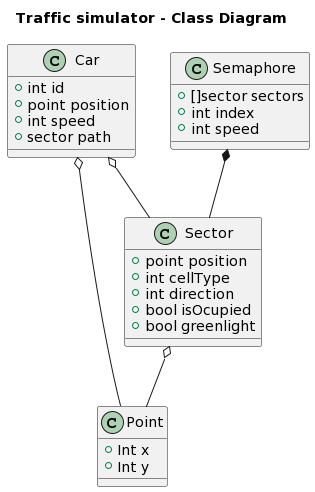

This program uses golang, and I decided to give it a terminal interface where each car simulated in here is it's own object so to say, having a channel each in which they simulate movement, same for the semaphores which interact with the car, next we'll see a class diagram of the program, while golang doesn't allow us to build classes itself, we'll take the structs as some sort of classes to visualize how the program works:
